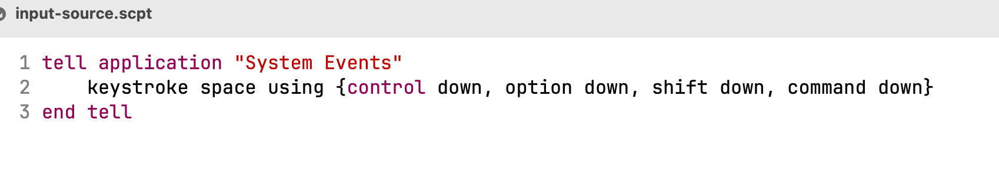

# mac系统下 ideavim 自动切换输入法(vim应该也可以,原理差不多,没测)
> 原理就是通过AppleScript去调用切换输入法的快捷键,我的为<ctrl+command+option+shift+space>;
> 
> 脚本执行的速度大体跟 `defaults read` 这条命令的时间相关
> 
> 默认功能:返回normal模式时自动切换输入法为英文
> 
> 附加功能:当执行了 `touch "$HOME/.input-source-vim/data"` ,会启动insert模式下上一次的输入法的记录

## 复制到home下

```shell
cp -r "input-source-vim" "$HOME/.input-source-vim"
touch "$HOME/.input-source-vim/data"
echo -n 0 > "$HOME/.input-source-vim/data"
```

## 修改vim配置

```shell
" 解决esc后光标左移的问题,自动切换输入法; 这是ideavim的写法,因为ideavim不支持autocmd命令,原生vim中可以用autocmd
inoremap <silent> <Esc> <Esc>`^:!/Users/logan/.input-source-vim/toggle-normal.sh<CR>
nnoremap <silent> i :!/Users/logan/.input-source-vim/toggle-insert.sh<CR>i
nnoremap <silent> I :!/Users/logan/.input-source-vim/toggle-insert.sh<CR>I
nnoremap <silent> o :!/Users/logan/.input-source-vim/toggle-insert.sh<CR>o
nnoremap <silent> O :!/Users/logan/.input-source-vim/toggle-insert.sh<CR>O
nnoremap <silent> a :!/Users/logan/.input-source-vim/toggle-insert.sh<CR>a
nnoremap <silent> A :!/Users/logan/.input-source-vim/toggle-insert.sh<CR>A
```

## 和我的输入法不一样的可能需要修改脚本


## ps: 文件 `input-source.scpt` 为模拟按键的AppleScript,若需要修改默认快捷键,需要用MacOS的脚本编辑器打开; 或者直接写在shell脚本里,写法google一下


